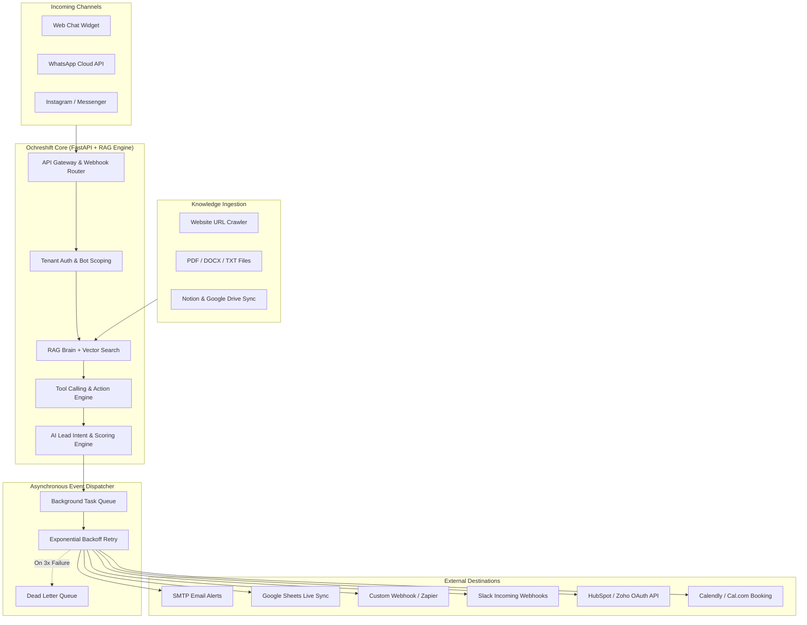
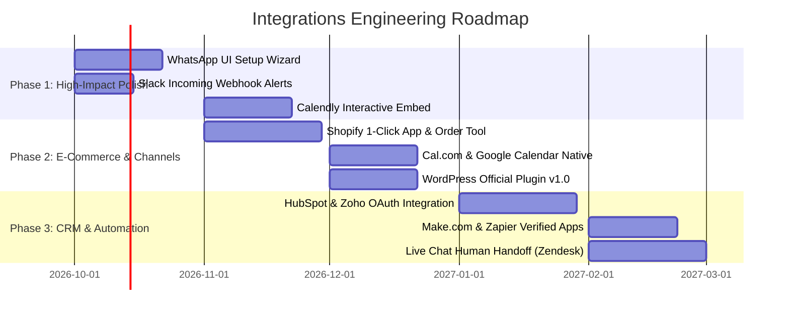

# 🔌 Ochreshift — Integrations Strategy & Engineering Architecture

> **Perspective:** Senior Team Lead + Product Manager  
> **Target Product:** Ochreshift (RAG AI Lead-Qualification & Customer Support Platform)  
> **Date:** September 2026  
> **Data Sources:** Verified live competitor benchmarks (Chatbase, Voiceflow, Botpress, Tidio, Crisp, Boei), SMB market data, and active Ochreshift codebase audit.

---

## 1. Executive Summary & Core Thesis

### The Product Manager’s Lens: The Retention & Monetization Engine
In conversational AI, **an isolated chatbot is an endangered feature; an integrated AI agent is an irreplaceable operational nervous system.**

1. **The Churn Trap:** AI chatbots that only live in a floating website bubble suffer 8–15% monthly churn. Why? When clients consider cutting costs, a standalone widget feels like an optional "nice-to-have" add-on.
2. **The Integration Moat:** When Ochreshift syncs captured leads instantly into a company's **Google Sheet or HubSpot CRM**, triggers high-intent alerts in **Slack/WhatsApp**, checks real-time inventory in **Shopify**, and books appointments in **Calendly**, churn drops below 2.5%.
3. **The Expansion Multiplier:** Integrations are the #1 catalyst for pricing upgrades. SMBs happily upgrade from Starter ($19/mo) to Growth ($49/mo) or Pro ($99/mo) not just for more message volume, but because **WhatsApp and CRM sync are tied to higher tiers**.

### The Senior Team Lead’s Lens: Scalable, Resilient Integration Architecture
From an engineering standpoint, third-party integrations introduce external failure points: rate limits, expired OAuth tokens, network timeouts, and non-standard JSON payloads.
- **Fail Closed vs. Async Resilient:** Chatbot conversations must NEVER hang because an external CRM or webhook is slow. All outbound integrations must run **asynchronously via non-blocking background workers with exponential backoff and dead-letter queues**.
- **Unified Adapter Pattern:** Instead of writing spaghetti code for every new integration, the backend must use an extensible **Adapter Interface** (`ChannelAdapter`, `IngestionAdapter`, `ActionAdapter`, and `EventDispatcher`).
- **Encrypted Multi-Tenant Vault:** Third-party credentials (API keys, OAuth tokens, WhatsApp system tokens) must be encrypted at rest using AES-256-GCM and scoped strictly by tenant (`user_id` / `bot_id`).

---

## 2. Competitor Benchmark — Verified Integration Ecosystems

| Competitor | Key Native Integrations | Integration Monetization Strategy | Key Strengths & Weaknesses |
|:---|:---|:---|:---|
| **Chatbase** | • **Channels:** Web embed, WordPress plugin, WhatsApp, Slack, Messenger, Instagram, Email, Phone (Twilio SIP)<br>• **CRMs:** HubSpot, Salesforce, Zendesk, Freshdesk, Gorgias, Zoho<br>• **Booking:** Calendly, Cal.com<br>• **Ecommerce:** Shopify<br>• **Automation:** Zapier, REST API | • Web embed & API on all plans.<br>• WhatsApp, Slack, & Notion unlocked on Hobby ($40/mo).<br>• Salesforce & Zendesk gated behind Standard ($150/mo) / Pro ($500/mo). | **Strengths:** Clean UI, broad coverage.<br>**Weaknesses:** Credit consumption is heavy on actions; no built-in native Google Sheets sync (relies on Zapier). |
| **Voiceflow** | • **CRMs:** Salesforce, HubSpot, Zendesk<br>• **Data:** Google Sheets, Airtable<br>• **Channels:** Twilio SMS, Gmail, Webchat<br>• **Extensibility:** REST API step, Custom JavaScript Functions, Model Context Protocol (MCP) | • Native integrations included in Pro ($50/editor/mo).<br>• Enterprise features (SSO, SOC-2, HIPAA) gated for custom contracts. | **Strengths:** Best-in-class tool calling & logic engine; native Google Sheets & Airtable.<br>**Weaknesses:** Developer-centric; steep learning curve for non-technical SMBs. |
| **Botpress** | • **Hub (100+ integrations):** WhatsApp, Slack, Intercom, Zendesk, HubSpot, Salesforce, Telegram, BigCommerce, Asana, Zapier, Webhooks | • Free tier gets access to community hub.<br>• Pay-as-you-go based on message volume ($0.005/msg above free allowance). | **Strengths:** Enormous integration library via open-source Hub.<br>**Weaknesses:** Complex deployment and configuration; difficult for solo business owners. |
| **Tidio** | • **Ecommerce:** Shopify, WooCommerce, BigCommerce, Wix, Squarespace, PrestaShop<br>• **CRMs:** HubSpot, Salesforce, Mailchimp, Klaviyo<br>• **Channels:** Live chat, Instagram, Messenger, WhatsApp | • E-commerce & lead forms on Starter ($29/mo).<br>• Lyro AI bot charged per conversation.<br>• Premium integrations (Salesforce) on higher plans. | **Strengths:** Unrivaled Shopify/WooCommerce e-commerce features (order tracking, cart rescue).<br>**Weaknesses:** Expensive per-seat add-ons; weak document RAG compared to modern LLM tools. |
| **Crisp** | • **Marketplace:** WordPress, Shopify, WooCommerce, Slack, WhatsApp, Telegram, HubSpot, Pipedrive, Zoho, Make, Zapier, n8n | • Essentials ($0/mo) = 2 seats, basic chat.<br>• Pro ($25/mo) = Slack, plugins.<br>• Unlimited ($95/mo) = All integrations (WhatsApp, CRM, automated triggers). | **Strengths:** Transparent flat-rate pricing ($95 for all features); rich plugin ecosystem.<br>**Weaknesses:** AI is an add-on, not the foundational brain. |
| **Boei** | • **Channels (50+):** WhatsApp, Messenger, Telegram, Phone, Email, Calendly, Google Maps, Instagram, Discord, SMS | • Starter ($19/mo), Growth ($49/mo), Business ($129/mo).<br>• Channels limited by plan tier. | **Strengths:** Instant floating launcher for 50+ channels; fast setup.<br>**Weaknesses:** Mostly a button redirector; limited deep bidirectional RAG actions. |

---

## 3. Market Demand & SMB Willingness-to-Pay (WTP)

Not all integrations are created equal. As a Product Manager, we must categorize integrations into three tiers based on **market demand**, **ease of setup for non-technical users**, and **revenue leverage**.

```mermaid
quadrantChart
    title Integration Impact vs. Implementation Effort
    x-axis Low Engineering Effort --> High Engineering Effort
    y-axis Low Customer Demand / WTP --> High Customer Demand / WTP
    quadrant-1 High Priority (Phase 2)
    quadrant-2 Quick Wins (Phase 1)
    quadrant-3 Low Priority / Niche
    quadrant-4 Complex Enterprise (Phase 3-4)
    "Google Sheets Sync": [0.18, 0.92]
    "Outbound Webhooks (Zapier/Make)": [0.22, 0.88]
    "1-Line HTML/WP Widget": [0.15, 0.95]
    "Meta WhatsApp Cloud API": [0.45, 0.96]
    "Calendly / Cal.com Booking": [0.30, 0.85]
    "Shopify Snippet / Order Lookup": [0.48, 0.82]
    "Slack Team Alerts": [0.25, 0.70]
    "HubSpot / Pipedrive Direct Sync": [0.55, 0.75]
    "Notion / Google Drive Ingestion": [0.60, 0.65]
    "Salesforce / Zendesk Enterprise": [0.85, 0.50]
```

### Tier 1: The Non-Negotiable Essentials (95% SMB Demand)
These are required to win self-serve users and justify even the Starter plan ($19/mo):
1. **1-Line Embed Script (Universal):** Works on WordPress, Shopify, Squarespace, Wix, Webflow, React, HTML. If installation takes more than 60 seconds, conversion drops 40%.
2. **Meta WhatsApp Cloud API:** In India, Europe, Southeast Asia, and LATAM, WhatsApp is not a secondary channel — it is the **primary sales counter**. Over 75% of Indian SMB leads transact via WhatsApp.
3. **Google Sheets Live Sync:** 80% of small businesses do NOT use Salesforce or HubSpot; their CRM is a shared Google Sheet. Syncing every lead into a live spreadsheet is an instant "WOW" feature.
4. **Outbound Webhooks (Zapier, Make, n8n):** Solves the long tail. By sending a structured JSON POST on every lead capture, Ochreshift instantly connects to 5,000+ business tools without custom backend code.
5. **Real-time Email Alerts (SMTP):** Instant notification to sales reps with AI Intent Scoring (Hot, Warm, Cold) so reps call back within 5 minutes.

### Tier 2: The Revenue Drivers ($49/mo Growth Tier Unlocks)
These integrations allow you to charge $49/mo and eliminate trial cancellations:
1. **Meeting & Appointment Scheduling (Calendly, Cal.com, Google Calendar):**
   - *Why it matters:* For salons, clinics, consultants, coaches, and B2B agencies, a lead is only valuable if it becomes a booked call. The bot qualifies the lead and displays the booking calendar directly in the chat.
2. **Shopify Native Integration:**
   - *Why it matters:* E-commerce merchants need two things: (1) Order tracking ("Where is my order #1234?"), and (2) Product recommendations. This cuts support volume by 40% instantly.
3. **Internal Team Channels (Slack, Discord, MS Teams):**
   - *Why it matters:* Sales and support teams live in Slack. A notification in `#sales-leads` with a one-click button to take over the conversation is 10x faster than checking email.
4. **Mid-Market CRM Direct Links (HubSpot, Pipedrive, Zoho CRM):**
   - Direct contact creation, pipeline deal placement, and conversation transcript attachment.

### Tier 3: High-Ticket & Enterprise Retainers ($99/mo Pro or $1,500+ Agency Builds)
1. **Omnichannel Social (Instagram DM, Facebook Messenger):** Meta Graph API integration to capture social shoppers.
2. **Enterprise Helpdesks (Zendesk, Freshdesk, Intercom Handoff):** Seamless transfer from AI bot to live human agent when sentiment is frustrated or lead is marked "Hot".
3. **Automated Knowledge Ingestion (Notion, Google Drive, Zendesk Help Center):** Real-time auto-reindexing when internal docs change.

---

## 4. Packaging & Pricing Strategy: How Integrations Encourage Upgrades

To maximize Average Revenue Per User (ARPU) and customer lifetime value (LTV), integrations should be packaged strategically across tiers:

| Tier | Monthly Price | Included Integrations | Upgrade Trigger / Value Hook |
|:---|:---|:---|:---|
| **Free / Trial** | $0 (7 days) | • Universal Website Widget<br>• Outbound Webhooks<br>• Email Alerts | Try before buying; verify widget works on site. |
| **Starter** | **$19/mo** (₹1,499) | • Universal Website Widget<br>• Outbound Webhooks (Zapier/Make)<br>• Instant Email Alerts<br>• **Google Sheets Live Sync** (Free Team CRM) | Perfect for solo consultants, bloggers, local service shops. |
| **Growth** | **$49/mo** (₹3,999) | • Everything in Starter +<br>• **Meta WhatsApp Cloud API** (1 Phone Number)<br>• **Calendly & Cal.com Scheduling**<br>• **Slack & Discord Team Alerts**<br>• **Shopify Snippet / Order Lookup** | The "Sweet Spot". Every SMB with a sales team or WhatsApp catalog upgrades here. |
| **Pro** | **$99/mo** (₹7,999) | • Everything in Growth +<br>• **HubSpot & Zoho CRM Direct Sync**<br>• **Zendesk & Freshdesk Live Agent Handoff**<br>• **Multi-Number WhatsApp** (up to 3)<br>• **Automated Notion & Drive Sync** | Built for fast-growing agencies, multi-brand merchants, and high-volume teams. |
| **Agency / Build** | **$1,500–$3,500** + Retainer | • Custom enterprise API integrations<br>• Done-for-you WhatsApp & CRM onboarding<br>• White-label dashboard & reports | High-margin agency revenue stream funding SaaS development. |

> [!TIP]
> **Product Growth Hack — The "Powered by Ochreshift" Watermark:**
> On the Starter tier, the widget and WhatsApp auto-responder include a discrete link: *"⚡ Powered by Ochreshift"*. Removing this badge is unlocked exclusively on the **Growth ($49/mo)** tier, creating a viral product loop while driving plan upgrades.

---

## 5. Current Ochreshift Codebase Audit — What Works & What’s Next

Based on an audit of the current repository:

```
┌─────────────────────────────────────────────────────────────────────────┐
│                        CURRENT INTEGRATION STATUS                       │
├────────────────────────────────┬────────────┬───────────────────────────┤
│ Integration Component          │ Status     │ Implementation Details    │
├────────────────────────────────┼────────────┼───────────────────────────┤
│ Universal Web Widget           │ ✅ Production│ Next.js Studio + EmbedCode│
│ Outbound Lead Webhooks         │ ✅ Production│ POST with JSON payload    │
│ Instant Email Alerts           │ ✅ Production│ SMTP + AI Intent Filter   │
│ Google Sheets Sync             │ ✅ Production│ Apps Script Webhook URL   │
│ Meta WhatsApp Cloud API        │ 🟡 Complete │ Webhook handshake & chat  │
│                                │   Backend  │ (Needs UI setup wizard)   │
│ Calendly / Cal.com Booking     │ ❌ Missing  │ Planned for Phase 2       │
│ Slack / Discord Notifications  │ ❌ Missing  │ Planned for Phase 2       │
│ Shopify App / Snippet          │ ❌ Missing  │ Planned for Phase 2       │
│ HubSpot / Zoho Native OAuth    │ ❌ Missing  │ Planned for Phase 3       │
│ Zendesk / Live Agent Handoff   │ ❌ Missing  │ Planned for Phase 3       │
└────────────────────────────────┴────────────┴───────────────────────────┘
```

---

## 6. Engineering Architecture Blueprint (Senior Team Lead Design)

### 6.1 Unified Integration Architecture Diagram



---

### 6.2 Key Architectural Components

#### Component 1: Non-Blocking Event Dispatcher (Async Worker)
External webhooks and CRMs can experience high latency (1–5 seconds) or downtime. The conversational RAG pipeline must return responses to users in **< 800ms**.
- **Rule:** Never `await` external integration calls inside the HTTP chat request handler.
- **Pattern:** The chat handler enqueues an `IntegrationEvent` into FastAPI `BackgroundTasks` or Celery/Redis queue.

```python
# ochreshift-backend/dispatcher.py (Conceptual Blueprint)
from dataclasses import dataclass
from typing import Any, Dict
import httpx
import logging

logger = logging.getLogger(__name__)

@dataclass
class LeadEvent:
    bot_id: str
    tenant_id: str
    contact_name: str
    contact_email: str
    contact_phone: str
    lead_score: str # "hot" | "warm" | "cold"
    summary: str
    conversation_id: str
    custom_data: Dict[str, Any]

async def dispatch_lead_integrations(event: LeadEvent, config: Dict[str, Any]):
    """
    Executes all configured integrations in parallel without blocking user chat.
    Includes timeout safety and isolated exception handling.
    """
    tasks = []
    
    # 1. Email Alert
    if config.get("notification_email"):
        tasks.append(send_email_task(event, config["notification_email"]))
        
    # 2. Outbound Webhook (Zapier/Make/Custom)
    if config.get("webhook_url"):
        tasks.append(send_webhook_task(event, config["webhook_url"]))
        
    # 3. Google Sheets
    if config.get("google_sheets_url"):
        tasks.append(send_sheets_task(event, config["google_sheets_url"]))
        
    # 4. Slack Team Alert
    if config.get("slack_webhook_url"):
        tasks.append(send_slack_task(event, config["slack_webhook_url"]))

    # Execute concurrently
    await asyncio.gather(*tasks, return_exceptions=True)
```

#### Component 2: Multi-Tenant Credentials Vault (AES-256-GCM)
Clients store sensitive credentials: WhatsApp Tokens, Slack Webhook URLs, and CRM API Keys.
- **Security Standard:** Plaintext storage in PostgreSQL/SQLite is unacceptable.
- **Implementation:**
  - An application master key `ENCRYPTION_KEY` is derived from an environment variable.
  - Every external token is encrypted before DB insertion: `encrypted_token = aes_gcm_encrypt(raw_token, key)`.
  - Decrypted only in-memory at execution time.

#### Component 3: Tool Calling & Dynamic Action Engine (Calendly & Shopify)
Modern AI agents must not only answer questions; they must execute actions.
- When a user asks: *"Can I book a demo for Thursday 3 PM?"* or *"Where is order #8921?"*
- The LLM outputs a function call:
  ```json
  {
    "tool": "check_shopify_order",
    "parameters": { "order_number": "8921", "customer_email": "user@example.com" }
  }
  ```
- Ochreshift’s `ActionEngine` securely queries the merchant's Shopify API and supplies the real status back to the LLM for natural phrasing.

---

## 7. Step-by-Step Implementation Roadmap



### Phase 1: Immediate High-Impact Polish (Months 1–2)
1. **WhatsApp Cloud API Self-Serve Wizard:**
   - The backend Meta webhook is already built (`main.py:1872`).
   - Add a step-by-step connection wizard in `SettingsView.tsx`: Phone Number ID, WABA ID, and Permanent Token with automated connection test button.
2. **Slack Team Webhooks:**
   - Add Slack incoming webhook support. Alerts sales reps directly in their `#leads` Slack channel with formatted blocks and a direct link to conversation history.
3. **Calendly & Cal.com In-Chat Scheduler:**
   - When user asks to book a meeting or qualifies as "Hot", render a native booking card right in the chat widget.

### Phase 2: E-Commerce & Distribution Channels (Months 3–4)
1. **Shopify Native App:**
   - 1-click install from Shopify App Store.
   - Auto-syncs product catalog into the RAG knowledge base.
   - Read-only order tracking tool for customers.
2. **Official WordPress Plugin:**
   - Submit to WordPress.org plugin repository.
   - Allows millions of WordPress site owners to install Ochreshift by entering their Bot API key (no code copying).

### Phase 3: CRM & Workflow Automation (Months 5–6)
1. **HubSpot & Zoho CRM OAuth App:**
   - Bi-directional contact sync and pipeline deal creation.
2. **Zapier & Make.com Public App:**
   - Verified integration in Zapier app directory (creates massive organic inbound SaaS traffic).
3. **Human Agent Handoff Protocol:**
   - Standardized WebSocket handoff to Zendesk, Crisp, or LiveChat when AI confidence is low.

---

## 8. Security, Privacy & Compliance Checklist

When integrating with third-party business systems, enterprise clients will demand compliance proof:

1. **GDPR & India DPDP Act 2023 Compliance:**
   - Right to Be Forgotten: When a lead is deleted in Ochreshift, trigger downstream webhook to remove data from connected CRMs.
   - PII Scrubbing: Automatically mask credit card numbers, passwords, and sensitive government IDs before storing in logs or dispatching to third-party webhooks.
2. **Webhook Security (SSRF Protection):**
   - Outbound webhooks must validate destination URLs to prevent Server-Side Request Forgery (SSRF) against internal VPC services (e.g., block `localhost`, `127.0.0.1`, `169.254.169.254`).
   - Sign all outgoing webhook payloads with `X-Ochreshift-Signature: sha256=...` using a tenant-specific webhook secret.
3. **Meta WhatsApp Business Policy:**
   - Ensure explicit opt-in consent before initiating business messaging.
   - Comply with Meta’s 24-hour customer service window for automated bot messaging.

---

## 9. Summary Action Plan for Team Lead & Product Manager

| Priority | Action Item | Owner | Target Milestone |
|:---|:---|:---|:---|
| **P0** | Build the WhatsApp Connection Wizard UI in `fortend` | Frontend Eng | Sprint 1 |
| **P0** | Add Slack Incoming Webhook alert support to `notifications.py` | Backend Eng | Sprint 1 |
| **P1** | Implement Calendly / Cal.com booking card in chat widget | Fullstack Eng | Sprint 2 |
| **P1** | Add HMAC-SHA256 signature signing to outbound webhooks | Backend Eng | Sprint 2 |
| **P2** | Develop Shopify App snippet & Order Lookup Tool | Backend / AI Eng | Sprint 3 |
| **P2** | Package and publish official WordPress plugin on WP.org | Frontend Eng | Sprint 4 |
